# Use Case - Cửa hàng thời trang

## Tác nhân (Actors)
Hệ thống có 2 tác nhân chính:
1. **Khách hàng (User)**: Người sử dụng hệ thống để xem và mua sản phẩm
2. **Quản trị viên (Admin)**: Người quản lý hệ thống, sản phẩm và đơn hàng

## Các Use Case

### Use Case cho Khách hàng (User)

1. **Xem sản phẩm**
   - **Xem danh sách sản phẩm**: Người dùng có thể xem danh sách tất cả sản phẩm có sẵn
   - **Xem chi tiết sản phẩm**: Người dùng có thể xem thông tin chi tiết, giá, kích cỡ, màu sắc và hình ảnh của một sản phẩm
   - **Xem sản phẩm theo danh mục**: Người dùng có thể lọc sản phẩm theo danh mục, thương hiệu hoặc mùa
   - **Xem sản phẩm bán chạy**: Người dùng có thể xem danh sách các sản phẩm bán chạy nhất

2. **Quản lý tài khoản**
   - **Đăng ký tài khoản**: Người dùng có thể tạo tài khoản mới với thông tin cá nhân
   - **Đăng nhập**: Người dùng có thể đăng nhập vào tài khoản đã tạo
   - **Xem và chỉnh sửa thông tin cá nhân**: Người dùng có thể xem và cập nhật thông tin cá nhân của mình
   - **Quên mật khẩu**: Người dùng có thể yêu cầu đặt lại mật khẩu nếu quên
   - **Đặt lại mật khẩu**: Người dùng có thể đặt mật khẩu mới sau khi xác nhận qua email

3. **Quản lý giỏ hàng**
   - **Thêm sản phẩm vào giỏ hàng**: Người dùng có thể chọn sản phẩm, kích cỡ, số lượng và thêm vào giỏ hàng
   - **Xem giỏ hàng**: Người dùng có thể xem các sản phẩm đã thêm vào giỏ hàng
   - **Cập nhật số lượng sản phẩm trong giỏ hàng**: Người dùng có thể tăng/giảm số lượng của sản phẩm trong giỏ hàng
   - **Xóa sản phẩm khỏi giỏ hàng**: Người dùng có thể xóa sản phẩm không muốn mua khỏi giỏ hàng

4. **Đặt hàng**
   - **Tạo đơn hàng**: Người dùng có thể chuyển từ giỏ hàng sang quy trình thanh toán
   - **Nhập thông tin giao hàng**: Người dùng có thể nhập địa chỉ và thông tin giao hàng
   - **Chọn phương thức thanh toán**: Người dùng có thể chọn phương thức thanh toán (trực tuyến, COD)
   - **Xác nhận đơn hàng**: Người dùng có thể xem lại và xác nhận thông tin đơn hàng
   - **Thanh toán đơn hàng**: Người dùng có thể hoàn tất thanh toán cho đơn hàng

5. **Quản lý đơn hàng**
   - **Xem lịch sử đơn hàng**: Người dùng có thể xem danh sách các đơn hàng đã đặt
   - **Xem chi tiết đơn hàng**: Người dùng có thể xem thông tin chi tiết của một đơn hàng
   - **Theo dõi trạng thái đơn hàng**: Người dùng có thể theo dõi trạng thái giao hàng (đang xử lý, đang giao, đã giao, đã hủy)
   - **Hủy đơn hàng**: Người dùng có thể hủy đơn hàng nếu chưa được giao

6. **Tương tác khác**
   - **Xem thông tin cửa hàng**: Người dùng có thể xem thông tin về cửa hàng, địa chỉ và liên hệ
   - **Chat với nhân viên/AI hỗ trợ**: Người dùng có thể trò chuyện với nhân viên hỗ trợ hoặc AI chatbot
   - **Đánh giá sản phẩm**: Người dùng có thể đánh giá và viết nhận xét về sản phẩm đã mua

### Use Case cho Quản trị viên (Admin)

1. **Quản lý sản phẩm**
   - **Xem danh sách sản phẩm**: Admin có thể xem danh sách tất cả sản phẩm với bộ lọc và sắp xếp
   - **Thêm sản phẩm mới**: Admin có thể thêm sản phẩm mới vào hệ thống với đầy đủ thông tin
   - **Chỉnh sửa thông tin sản phẩm**: Admin có thể cập nhật thông tin, giá, số lượng của sản phẩm
   - **Xóa sản phẩm**: Admin có thể xóa sản phẩm khỏi hệ thống
   - **Quản lý hình ảnh sản phẩm**: Admin có thể thêm, xóa, sắp xếp hình ảnh sản phẩm
   - **Xuất Excel danh sách sản phẩm**: Admin có thể xuất danh sách sản phẩm ra file Excel

2. **Quản lý danh mục**
   - **Xem danh sách danh mục**: Admin có thể xem tất cả danh mục sản phẩm
   - **Thêm danh mục mới**: Admin có thể tạo danh mục mới
   - **Chỉnh sửa danh mục**: Admin có thể cập nhật thông tin danh mục
   - **Xóa danh mục**: Admin có thể xóa danh mục không cần thiết

3. **Quản lý thương hiệu**
   - **Xem danh sách thương hiệu**: Admin có thể xem tất cả thương hiệu trong hệ thống
   - **Thêm thương hiệu mới**: Admin có thể thêm thương hiệu mới
   - **Chỉnh sửa thương hiệu**: Admin có thể cập nhật thông tin thương hiệu
   - **Xóa thương hiệu**: Admin có thể xóa thương hiệu không cần thiết

4. **Quản lý kích cỡ/mùa**
   - **Quản lý kích cỡ sản phẩm**: Admin có thể thêm, sửa, xóa các kích cỡ
   - **Quản lý mùa (season)**: Admin có thể thêm, sửa, xóa các mùa sản phẩm (xuân, hè, thu, đông)

5. **Quản lý đơn hàng**
   - **Xem danh sách đơn hàng**: Admin có thể xem tất cả đơn hàng trong hệ thống
   - **Xem chi tiết đơn hàng**: Admin có thể xem thông tin chi tiết của đơn hàng
   - **Cập nhật trạng thái đơn hàng**: Admin có thể thay đổi trạng thái đơn hàng (đang xử lý, đang giao, đã giao, đã hủy)
   - **Xử lý đơn hàng**: Admin có thể xác nhận và xử lý các đơn hàng mới
   - **Quản lý hoàn trả đơn hàng**: Admin có thể xử lý các yêu cầu hoàn trả đơn hàng

6. **Quản lý khách hàng**
   - **Xem danh sách khách hàng**: Admin có thể xem danh sách tất cả khách hàng
   - **Xem chi tiết thông tin khách hàng**: Admin có thể xem thông tin chi tiết của một khách hàng

7. **Quản lý mã giảm giá và khuyến mãi**
   - **Tạo mã giảm giá**: Admin có thể tạo mã giảm giá với các điều kiện và thời hạn
   - **Quản lý khuyến mãi**: Admin có thể tạo các chương trình khuyến mãi
   - **Áp dụng/hủy bỏ khuyến mãi**: Admin có thể kích hoạt hoặc ngừng các chương trình khuyến mãi

8. **Quản lý nhà cung cấp**
   - **Xem danh sách nhà cung cấp**: Admin có thể xem danh sách tất cả nhà cung cấp
   - **Thêm nhà cung cấp mới**: Admin có thể thêm nhà cung cấp mới
   - **Chỉnh sửa thông tin nhà cung cấp**: Admin có thể cập nhật thông tin nhà cung cấp
   - **Xóa nhà cung cấp**: Admin có thể xóa nhà cung cấp không cần thiết

9. **Báo cáo và thống kê**
   - **Xem thống kê doanh số**: Admin có thể xem doanh số bán hàng
   - **Xem thống kê đơn hàng theo trạng thái**: Admin có thể xem số lượng đơn hàng theo từng trạng thái
   - **Xem thống kê sản phẩm bán chạy**: Admin có thể xem các sản phẩm bán chạy nhất
   - **Xem biểu đồ tăng trưởng khách hàng**: Admin có thể xem sự thay đổi số lượng khách hàng theo thời gian
   - **Phân tích dữ liệu theo ngày/tuần/tháng/năm**: Admin có thể xem và phân tích dữ liệu theo các khung thời gian khác nhau

10. **Quản lý đánh giá**
    - **Xem danh sách đánh giá**: Admin có thể xem tất cả đánh giá từ khách hàng
    - **Phê duyệt/từ chối đánh giá**: Admin có thể quyết định hiển thị hoặc ẩn các đánh giá

## Biểu đồ Use Case (PlantUML)

```plantuml
@startuml
left to right direction
skinparam packageStyle rectangle
skinparam actorStyle awesome
skinparam usecaseBackgroundColor #F0F8FF
skinparam usecaseBorderColor #4682B4

actor "Khách hàng\n(User)" as User #LightBlue
actor "Quản trị viên\n(Admin)" as Admin #LightGreen

rectangle "Hệ thống cửa hàng thời trang online" {
  ' User Use Cases
  package "Sản phẩm" {
    usecase "Xem danh sách sản phẩm" as UC1
    usecase "Xem chi tiết sản phẩm" as UC1_1
    usecase "Xem sản phẩm theo danh mục" as UC1_2
    usecase "Xem sản phẩm bán chạy" as UC1_3
  }
  
  package "Tài khoản" {
    usecase "Đăng ký tài khoản" as UC2_1
    usecase "Đăng nhập" as UC2_2
    usecase "Quản lý thông tin cá nhân" as UC2_3
    usecase "Quên/đặt lại mật khẩu" as UC2_4
  }
  
  package "Giỏ hàng" {
    usecase "Thêm sản phẩm vào giỏ hàng" as UC3_1
    usecase "Xem giỏ hàng" as UC3_2
    usecase "Cập nhật số lượng sản phẩm" as UC3_3
    usecase "Xóa sản phẩm khỏi giỏ hàng" as UC3_4
  }
  
  package "Đặt hàng" {
    usecase "Tạo đơn hàng" as UC4_1
    usecase "Nhập thông tin giao hàng" as UC4_2
    usecase "Chọn phương thức thanh toán" as UC4_3
    usecase "Xác nhận và thanh toán" as UC4_4
  }
  
  package "Quản lý đơn hàng (User)" {
    usecase "Xem lịch sử đơn hàng" as UC5_1
    usecase "Xem chi tiết đơn hàng" as UC5_2
    usecase "Theo dõi trạng thái đơn hàng" as UC5_3
    usecase "Hủy đơn hàng" as UC5_4
  }
  
  package "Tương tác" {
    usecase "Xem thông tin cửa hàng" as UC6_1
    usecase "Chat với nhân viên/AI" as UC6_2
    usecase "Đánh giá sản phẩm" as UC6_3
  }
  
  ' Admin Use Cases
  package "Quản lý sản phẩm (Admin)" {
    usecase "Xem danh sách sản phẩm" as UC7_1
    usecase "Thêm sản phẩm mới" as UC7_2
    usecase "Chỉnh sửa sản phẩm" as UC7_3
    usecase "Xóa sản phẩm" as UC7_4
    usecase "Quản lý hình ảnh sản phẩm" as UC7_5
    usecase "Xuất Excel sản phẩm" as UC7_6
  }
  
  package "Quản lý danh mục" {
    usecase "Quản lý danh mục sản phẩm" as UC8
    usecase "Quản lý thương hiệu" as UC9
    usecase "Quản lý kích cỡ và mùa" as UC10
  }
  
  package "Quản lý đơn hàng (Admin)" {
    usecase "Xem danh sách đơn hàng" as UC11_1
    usecase "Cập nhật trạng thái đơn hàng" as UC11_2
    usecase "Xử lý đơn hàng" as UC11_3
    usecase "Quản lý hoàn trả" as UC11_4
  }
  
  package "Khách hàng & Marketing" {
    usecase "Quản lý khách hàng" as UC12
    usecase "Quản lý mã giảm giá" as UC13_1
    usecase "Quản lý khuyến mãi" as UC13_2
    usecase "Quản lý nhà cung cấp" as UC14
    usecase "Quản lý đánh giá" as UC16
  }
  
  package "Báo cáo & Thống kê" {
    usecase "Xem thống kê doanh số" as UC15_1
    usecase "Phân tích đơn hàng" as UC15_2
    usecase "Xem sản phẩm bán chạy" as UC15_3
    usecase "Theo dõi tăng trưởng" as UC15_4
  }
  
  ' User relationships
  User --> UC1
  User --> UC1_1
  User --> UC1_2
  User --> UC1_3
  
  User --> UC2_1
  User --> UC2_2
  User --> UC2_3
  User --> UC2_4
  
  User --> UC3_1
  User --> UC3_2
  User --> UC3_3
  User --> UC3_4
  
  User --> UC4_1
  User --> UC4_2
  User --> UC4_3
  User --> UC4_4
  
  User --> UC5_1
  User --> UC5_2
  User --> UC5_3
  User --> UC5_4
  
  User --> UC6_1
  User --> UC6_2
  User --> UC6_3

  ' Admin relationships
  Admin --> UC7_1
  Admin --> UC7_2
  Admin --> UC7_3
  Admin --> UC7_4
  Admin --> UC7_5
  Admin --> UC7_6
  
  Admin --> UC8
  Admin --> UC9
  Admin --> UC10
  
  Admin --> UC11_1
  Admin --> UC11_2
  Admin --> UC11_3
  Admin --> UC11_4
  
  Admin --> UC12
  Admin --> UC13_1
  Admin --> UC13_2
  Admin --> UC14
  Admin --> UC16
  
  Admin --> UC15_1
  Admin --> UC15_2
  Admin --> UC15_3
  Admin --> UC15_4
}
@enduml
``` 

